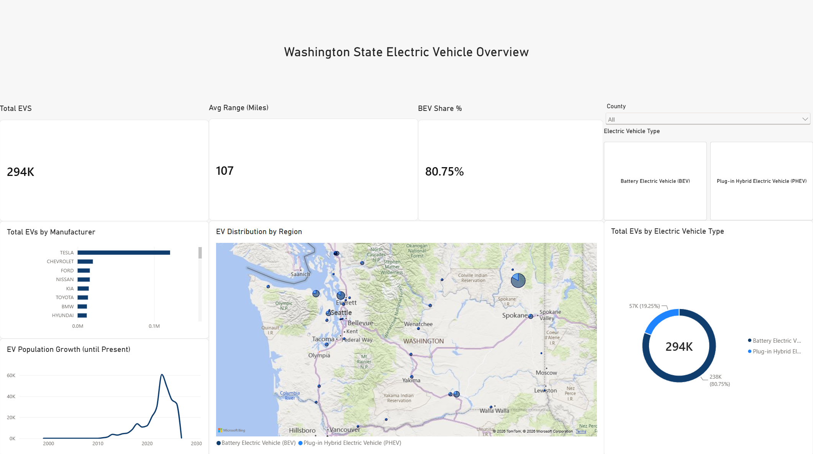

## 🚗 Washington State Electric Vehicle Population Dashboard

An executive Power BI dashboard analyzing the adoption, growth, and geographical distribution of Electric Vehicles (EVs) across Washington State.



---

## 📌 Project Overview
* **Data Source:** [catalog.data.gov - EV Population Data](https://catalog.data.gov/dataset/electric-vehicle-population-data)
* **Latest Dataset Update:** August 24, 2026
* **Tech Stack:** Power BI Desktop, DAX, Custom UI Styling

---

## 📊 Key Insights & Metrics
* **Total EVs:** 294K total registered vehicles.
* **BEV Dominance:** Battery Electric Vehicles make up **80.75%** of the entire EV fleet.
* **Top Manufacturer:** Tesla continues to hold the largest market share in registered models.
* **Geographic Distribution:** Dense adoption concentrated across urban counties (Seattle, Bellevue, Spokane).

---

## 🛠️ Key DAX Measures
* **BEV Share %:**
  ```dax
  BEV Share % = 
  CALCULATE(
      DIVIDE([Total BEV], [Total EVs], 0),
      REMOVEFILTERS('electric_vehicle_population_data_state_of_washington'[Electric Vehicle Type])
  )
